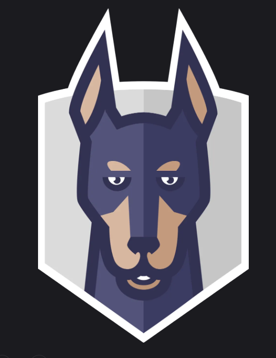
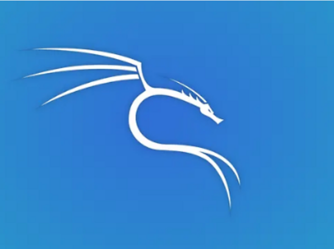
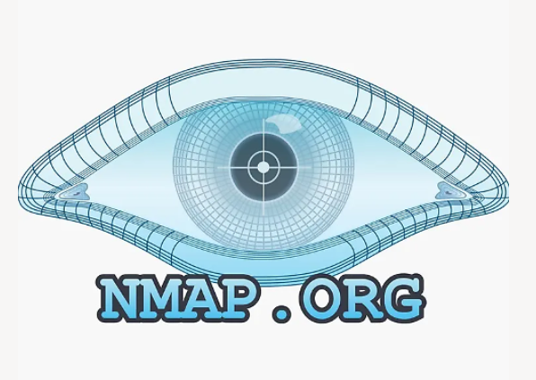

## ¿Tienes alguna duda sobre mis proyectos?
  <a href="https://terracota19.github.io/terracota19-assistant.github.io/" target="_blank" rel="noopener noreferrer">
  ¡Pregúntale a mi Asistente Virtual Chatbot!
  </a>

## Programming Languages
      

## CyberTools
          
   
